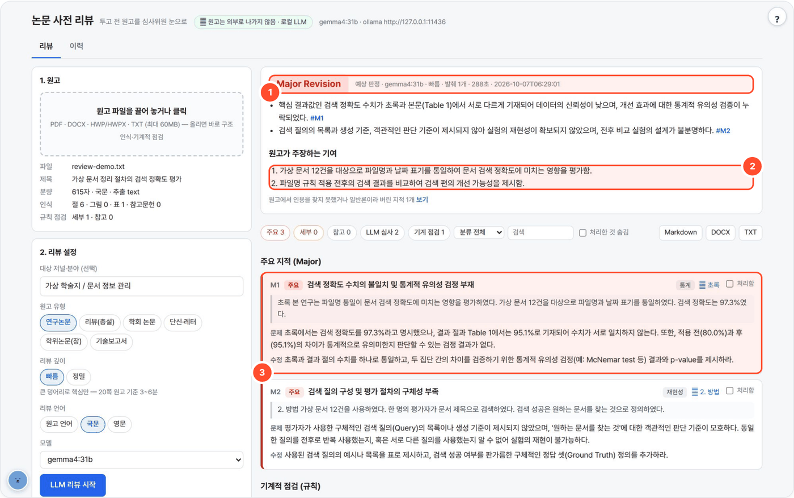
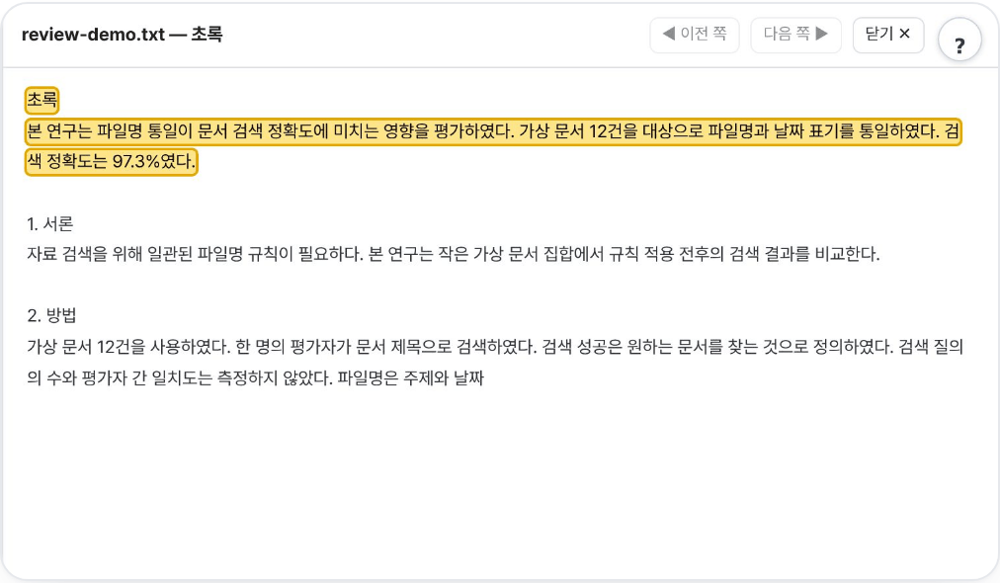

# review-local — 투고 전 논문 사전 리뷰어

> 원고 구조와 형식 문제를 먼저 규칙으로 점검하고, 로컬 LLM이 심사위원 관점의 주요·세부 지적과 예상 심사 질문을 만듭니다. 지적의 인용을 눌러 원문 위치를 확인합니다.



## 무엇을 하나

- 원고(PDF·DOCX·HWP/HWPX·TXT, 최대 60MB)를 올리면 **규칙 기반 기계적 점검**(미언급 그림·표, 없는 번호 언급, 인용·참고문헌 불일치, 약어 미정의, 초록-본문 수치 불일치 …)이 바로 나옵니다.
- **LLM 리뷰**: 기여 요약, 예상 판정, 주요·세부 지적, 예상 질문 5개.
- 모든 LLM 지적은 원고 문장을 인용해야 하고, 프로그램이 **그 인용이 원고에 실제로 있는지 확인**해 없으면 버립니다. 원고 다른 곳에 이미 답이 있는 지적은 **교차 확인**으로 한 번 더 걸러 냅니다.
- 로컬 LLM만 쓰고 원고를 외부로 보내지 않습니다. 표준 라이브러리만(설치할 패키지 없음), CDN 없음.

## 사용 방법

화면의 번호: **①** 예상 판정(확인된 지적을 근거로 종합한 참고 판정) · **②** 원고 개요(원고가 주장하는 기여와 연구 설계) · **③** 지적 카드(인용·문제·수정 방향)

1. **원고를 올린다** — PDF·DOCX·HWP/HWPX·TXT 등을 올리면 구조와 규칙 점검 결과가 먼저 나옵니다.
2. **설정 후 리뷰를 시작한다** — 대상 저널·분야, 원고 유형, 리뷰 깊이(빠름/정밀), 리뷰 언어와 모델을 고르고 **LLM 리뷰 시작**.
3. **근거를 확인하고 처리한다 (① ② ③)** — 지적의 위치·인용을 눌러 원문을 대조합니다. 처리함 체크와 필터를 쓰고 Markdown·DOCX·TXT로 받습니다.



## 예시

합성 원고 `review-demo.txt`(가상 문서 정리 연구)로 실제 돌린 결과입니다. 설정: 빠름 · 국문 · 대상 "가상 학술지 / 문서 정보 관리" · `gemma4:31b`.

입력(원고 발췌):

```text
검색 정확도는 97.3%였다.            ← 초록
규칙 적용 후 검색 정확도는 95.1%였다. ← 결과
표준편차와 신뢰구간은 계산하지 않았다.
```

출력(발췌):

```text
예상 판정: Major Revision
M1 (주요·통계) 검색 정확도 수치의 불일치 및 통계적 유의성 검정 부재  — 초록 97.3% ↔ 본문 95.1%
M2 (주요·재현성) 검색 질의 구성 및 평가 절차의 구체성 부족
```

> 예상 판정은 투고 결과를 예측하는 확정값이 아닙니다. 판정보다 지적 하나하나의 근거(인용·위치)를 보고 판단하세요.

## 설치·실행

```bash
bash setup.sh                  # Python·pdftotext → LLM 서버 탐색 → selftest → http://localhost:8782
bash setup.sh stop
python3 app.py                 # 수동 실행
python3 app.py --cli paper.pdf deep ko > review.md     # 터미널 (깊이 quick|deep, 언어 auto|ko|en; JOURNAL=… MTYPE=… 환경변수)
python3 selftest.py            # 가짜 LLM + 합성 원고로 검증 (WORKSPACE 를 임시 폴더로 바꿔 돌고 지움)
```

[agent-page-portal](https://github.com/gggg8657/agent-page-portal)에서 띄우면 포털이 포트(8782)·`WORKSPACE`·LLM 설정(로컬 Ollama `gemma4:31b`)을 넣어 줍니다.

| 환경변수 | 기본 | 설명 |
|---|---|---|
| `PORT` | `8782` | |
| `WORKSPACE` | `./_workspace` | 리뷰 이력 `history/<id>.json` (추출 텍스트 + 점검·리뷰 결과. 원본 파일은 저장하지 않음) |
| `LLM_API` / `LLM_BASE_URL` / `LLM_MODEL` | `ollama` / `http://localhost:11434` / `qwen3:8b` | 포털 실행 시 로컬 Ollama `gemma4:31b`. OpenAI 호환 서버면 `LLM_API=openai` |
| `LLM_API_KEY` | (없음) | OpenAI 호환 서버용(선택) |
| `NUM_CTX` | `32768` | Ollama 컨텍스트. 발췌(빠름 ~2만 자, 정밀 ~8천 자)가 여기에 맞춰져 있음 |
| `KORDOC_CLI` | 자동 | HWP·HWPX 용 kordoc `dist/cli.js`. 없으면 `../kordoc-local`, `../notebook-local` 의 것을 빌려 씀 |

## API

| 메서드 | 경로 | 설명 |
|---|---|---|
| GET | `/api/health` · `/api/meta` · `/api/models` | 상태 · 선택지 · LLM 모델 |
| POST | `/api/upload` | 원고 업로드(base64) → 추출·구조·기계적 점검 결과 |
| POST | `/api/run` | LLM 리뷰 (SSE 진행 스트림) |
| GET | `/api/history` · `/api/history/<id>` | 리뷰 이력 |
| POST | `/api/history/delete` | 이력 삭제 |
| GET | `/api/export/<id>.md` · `.txt` · `.docx` | 결과 내려받기 |

## 흐름
1. **추출** — PDF: `pdftotext`(쪽 단위), DOCX: zipfile+XML(Word 가 저장한 쪽 나눔으로 쪽 근사), HWP/HWPX: kordoc, TXT: 그대로(`\f` 는 쪽 나눔).
   쪽 번호 줄·반복 머리말/꼬리말 제거, 합자(fi) 풀기.
2. **구조** — 절 제목(번호식 `3.2 …`, pdftotext 의 `3.2` / `제목` 두 줄 배치, 로마 숫자, `Abstract`·`참고문헌` 같은 무번호, 마크다운 `#`)을 앞 번호의 '다음 번호'일 때만 인정(표 안 숫자 오인 방지).
   절 종류(초록·서론·방법·결과·논의·결론·참고문헌) 판별, 그림·표 캡션(`Fig. 3.`/`Table 2:`/`그림 1.`/`<표 1>`), 참고문헌 목록(번호식/저자-연도).
3. **기계적 점검(LLM 없음)** — 그림·표: 본문 미언급 / 없는 번호 언급 / 번호 건너뜀 / 첫 언급 순서 / `Fig.`·`Figure` 혼용.
   인용: 목록에 없는 번호 `[n]` / 미인용 참고문헌 / 등장 순서 / 저자-연도 인용과 목록 대조. 약어: 정의 없음 / 정의 전 사용.
   수치: 초록·결론의 수치가 본문·표에 없음, **같은 문맥(앞 낱말 3개)에서 값이 다름**(예: 초록 "정확도 97.3%" ↔ 결과 "정확도는 95.1%"). 수식: 없는 번호 `Eq. (7)`.
   그 밖에 단어 반복, 숫자-단위 붙여쓰기, `data-set`/`dataset` 표기 혼용, 절 구성·초록 분량.
4. **LLM 리뷰** — ① 개요(원고가 주장하는 기여 3줄·핵심 주장·연구 설계) ② 절 경계로 나눈 발췌마다 심사 지적(심각도·분류·요지·**원문 인용**·문제·수정·검색어)
   ③ 인용을 원고에서 찾기(공백·줄바꿈·하이픈·따옴표 무시, 낱말 한두 개 차이 허용) — 못 찾거나 일반론("영어 교정", "최신 문헌 추가")이면 버림
   ④ 같은 문제를 되풀이한 지적 합치기 ⑤ **교차 확인**: 지적마다 검색어로 원고 다른 곳 문단을 찾아 붙여 "이미 답이 있는가"를 다시 묻고, 해소된 것은 버림
   ⑥ 종합: 예상 판정(Accept/Minor/Major/Reject) + 근거 지적 번호, 예상 심사위원 질문 5개 + 답변 준비 팁.
5. **출력** — 화면(심각도·출처·분류 필터, 검색, 처리함 체크, 위치 클릭 → 그 쪽 원문에서 인용 강조), Markdown·DOCX·TXT 내려받기, 이력.

## 한계
- 텍스트 추출 기반이라 **그림 안의 내용·표의 칸 구조·수식**은 보지 못합니다. 캡션이 이미지 안에 있으면 그림 점검을 건너뜁니다. 위첨자 인용(¹²)은 확인할 수 없습니다.
- 스캔 PDF 는 OCR 이 필요합니다(이 도구는 OCR 하지 않음).
- 약어 점검은 분야에서 흔한 약어(BLEU, RNN …)도 정의 없으면 알립니다 — 저널 규정에 따라 무시하세요.
- LLM 판정은 엄격한 쪽으로 기울어 있습니다. 판정보다 **지적 하나하나의 근거(인용·위치)** 를 보고 판단하세요. 버린 지적은 화면에서 "보기"로 확인할 수 있습니다.
- 대상 저널의 투고 규정을 알지 못합니다(지어내지 않도록 막아 둠). 분량·형식 규정은 저널 안내를 확인하세요.

## 출처·감사 (Credits)

- 파이썬 표준 라이브러리만 씁니다. PDF 는 poppler-utils `pdftotext` (GPL, 외부 프로그램), HWP·HWPX 는 [kordoc](https://github.com/chrisryugj/kordoc) (MIT, chrisryugj) 를 외부 프로그램으로 호출(동봉 안 함)
- **LLM 실행** — Ollama API 또는 OpenAI 호환 API 로 호출합니다(모델 가중치는 동봉하지 않음). 기본 배포는 [Ollama](https://github.com/ollama/ollama) (MIT) 위의 Google [Gemma](https://ai.google.dev/gemma) `gemma4:31b` — 모델 이용 조건은 Gemma 배포처 참고.
- 이 도구는 [agent-page-portal](https://github.com/gggg8657/agent-page-portal) 에 연결해 쓰도록 만들었습니다(단독 실행도 됨).

저작권 표기·전체 목록은 `NOTICE` 를 보세요.

## 라이선스

MIT License — Copyright (c) 2026 gggg8657. `LICENSE` 참고.
